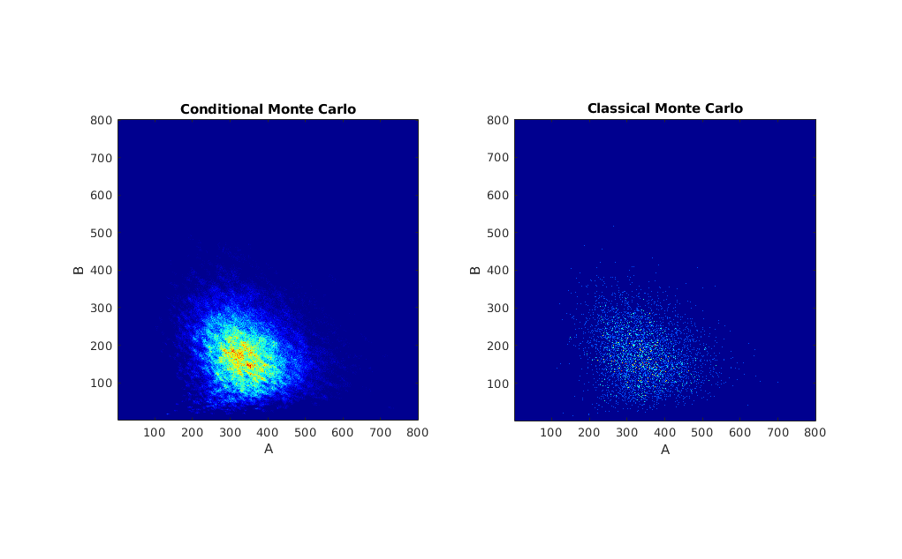

# Conditional Monte Carlo for Reaction Networks
This repository contains an example implementation of algorithm decribed in the paper [Conditional Monte Carlo for Reaction Networks](http://TODO.com) by Anderson and Ehlert. To run the code, open Matlab and run the script `compare_cmc_and_mc.m`. That script runs both conditional and classical Monte Carlo for a Lotka-Volterra model with a fixed initial state. The code then plots their respective estimates of the probability mass function of the state at a future time.

In order to make the comparison fair, first we run conditional Monte Carlo and keep track of the total number of random variates it uses. Then we give that number to classical Monte Carlo, and it runs independent simulations until it uses up at least the same number of random variates.

To speed up the underlying stochastic simulation algorithm, first run `gen_c_code.m`, which uses Matlab's "coder" package to generate C code from Matlab code. In order to do that, you need to install the package. It is not a requirement, but it helps a lot.

Here is some example output. Below are the estimates of the probability mass function of the state at time 4 for the Lotka-Volterra model. The simulations always started at the state (200, 100). The details of the model are in `sim_lotka_volterra.m`.

